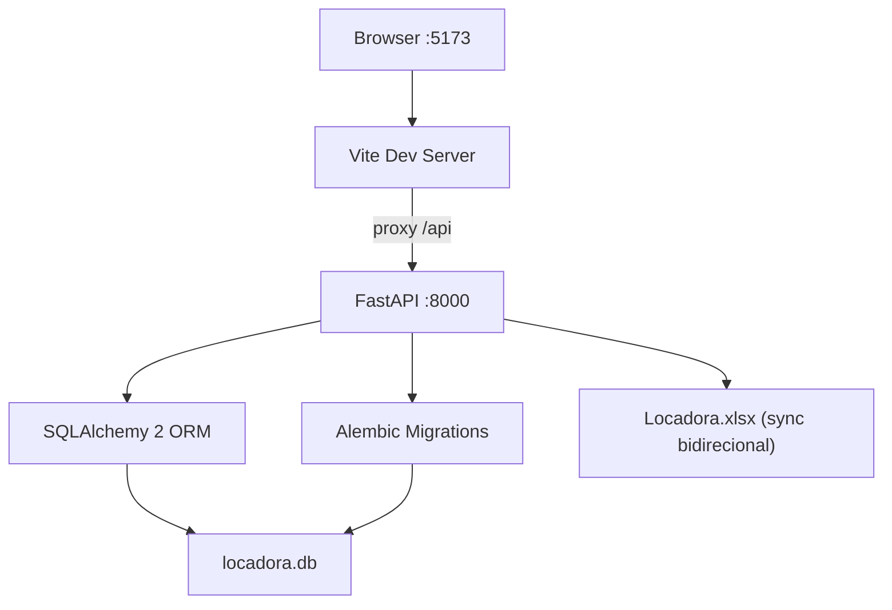

# Aspen — Fleet Management Dashboard


> **Dashboard financeiro e operacional para gestão de frotas de locação — construído como portfolio de engenharia.**


Sistema single-tenant de gestão de frota com ~500 veículos. Consolida dados operacionais, financeiros e logísticos de múltiplas empresas em uma interface unificada: ordens de serviço, contratos, apólices de seguro, débitos veiculares (IPVA/Licenciamento/Multas), rastreamento e reembolsos.

---

## Arquitetura



---

## Stack

| Camada      | Tecnologia                                                         |
|-------------|--------------------------------------------------------------------|
| Backend     | FastAPI, SQLAlchemy 2, Alembic, Pydantic v2, SQLite               |
| Frontend    | React 18, Vite, Tailwind CSS v3, React Hot Toast                  |
| Testes      | pytest, pytest-anyio, FastAPI TestClient, SQLite in-memory        |
| Sincronismo | openpyxl / pandas para sync bidirecional Excel ↔ SQLite           |

---

## Setup

### 1. Backend

```bash
cd backend
pip install -r requirements.txt
alembic upgrade head          # aplica todas as migrations
uvicorn main:app --reload --port 8000
```

### 2. Popular o banco com dados de demonstração

O repositório não inclui o banco de dados. Para visualizar o sistema funcionando:

```bash
cd backend
python scripts/seed.py
# Para resetar e re-seedar do zero:
# python scripts/seed.py --reset
```

Isso cria automaticamente: **3 empresas · 40 veículos · 6 contratos · 3 apólices de seguro · 40 rastreamentos · débitos IPVA/Licenciamento · multas de trânsito · OS finalizadas · reembolsos**.

### 3. Frontend

```bash
cd frontend
cp .env.example .env          # ajustar VITE_PRIMARY_COMPANY_SIGLA se necessário
npm install
npm run dev                   # porta 5173
```

### 4. Testes

```bash
cd backend
pytest tests/ -v
```

### One-shot (Windows)

```bat
start.bat
```

Abre backend e frontend automaticamente.

---

## Deploy em Produção (Demonstração Online)

O projeto está configurado para deploy gratuito e automatizado: o backend na **Render.com** (com banco de dados SQLite e seed automático) e o frontend na **Vercel**.

### Como subir sua própria demonstração online:

#### 1. Backend (Render.com)
1. Crie uma conta gratuita em [render.com](https://render.com).
2. Clique em **New** -> **Web Service** e conecte seu repositório do GitHub.
3. A Render detectará automaticamente o arquivo [render.yaml](render.yaml) na raiz do projeto.
4. Aguarde o build (~2-3 minutos). O backend será inicializado, as migrações do Alembic serão executadas e os dados de teste serão populados via `seed.py` automaticamente.
5. Copie a URL do seu serviço (ex: `https://aspen-api.onrender.com`).

#### 2. Frontend (Vercel)
1. Crie uma conta gratuita em [vercel.com](https://vercel.com).
2. Importe o repositório do GitHub no painel da Vercel.
3. Configure o diretório raiz (**Root Directory**) como `frontend`.
4. Adicione a variável de ambiente (**Environment Variable**):
   - `VITE_API_BASE_URL` = URL do backend gerada no Render (ex: `https://aspen-api.onrender.com`).
5. Clique em **Deploy**.
6. Copie a URL gerada pelo Vercel (ex: `https://aspen.vercel.app`).

#### 3. Configurar CORS no Render
1. No painel da Render, vá em **Environment** no seu serviço web.
2. Atualize a variável `CORS_ORIGINS` adicionando a URL do seu frontend gerada pelo Vercel.
3. A Render fará o redeploy automático para aplicar a mudança de CORS.

> [!NOTE]
> **Limitação do Plano Gratuito (Render)**: Por usar a categoria gratuita da Render, o backend "dorme" após 15 minutos sem requisições. O primeiro acesso após esse período pode levar cerca de 30 a 50 segundos para inicializar (um aviso amigável de carregamento será exibido na tela enquanto o servidor acorda). Além disso, os dados fictícios do banco de dados SQLite serão recriados a cada reinicialização automática.

---

## Decisões Arquiteturais

### Por que SQLite?

Sistema single-tenant de gestão de frota com ~500 veículos. SQLite elimina infraestrutura: backups são um simples `cp locadora.db backup.db`. Trocar para PostgreSQL exige apenas mudar `DATABASE_URL` em `backend/config.py` — SQLAlchemy abstrai o dialeto completamente.

### Auth omitida propositalmente

Aplicação interna sem usuários anônimos. A decisão foi consciente: adicionar JWT/OAuth seria overengineering para o contexto. O README documenta isso explicitamente para entrevistadores.

### Alembic para migrations

Todas as mudanças de schema são versionadas em `backend/alembic/versions/`:
- **0001** — baseline no-op (congela o estado inicial)
- **0002** — consolida migrations legadas ad-hoc
- **0003** — genericiza nomes de empresas (remove hardcodes de siglas)

Nunca editar tabelas manualmente.

### N+1 eliminado com bulk maps

Padrão estabelecido em `backend/routers/contratos.py` (`_build_maps`) e replicado em `seguro`, `debitos`, `rastreamento` e `reembolsos`: 3 queries bulk com `IN (...)` substituem 1 query por registro, resultando em complexidade O(1) de queries independente do volume de dados.

### Sincronismo Excel ↔ SQLite

O sistema legado usava planilhas como fonte de dados primária. A migração foi incremental: `sync_excel_to_db()` importa OS históricas do Excel; `sync_db_to_excel()` escreve OS finalizadas de volta. Ambas são idempotentes. As funções rodam no startup via `asyncio.to_thread` para não bloquear o event loop.

---

## Estrutura do Projeto

```
backend/
├── alembic/                 # Migrations versionadas
│   └── versions/
├── routers/                 # Endpoints por domínio
│   ├── contratos.py
│   ├── debitos.py           # IPVA, Licenciamento, Multas
│   ├── fleet.py
│   ├── rastreamento.py
│   ├── reembolsos.py
│   ├── seguro.py
│   └── orders.py
├── services/
│   ├── excel_io.py          # Sync bidirecional com Locadora.xlsx
│   ├── os_helpers.py        # Geração atômica de numero_os, validação
│   └── regras.py            # Constantes de negócio centralizadas
├── tests/
│   ├── conftest.py          # Fixtures: DB in-memory, seed_empresa, seed_frota
│   ├── test_contratos.py
│   ├── test_debitos.py
│   ├── test_rastreamento.py
│   └── test_seguro.py
├── models.py                # SQLAlchemy ORM (entidades completas)
├── schemas.py               # Pydantic v2 (request/response)
└── main.py                  # FastAPI app + lifespan

frontend/
├── src/
│   ├── contexts/
│   │   └── EnumsContext.jsx # Enums do backend via React Context
│   ├── utils/
│   │   ├── api.js           # Chamadas axios centralizadas
│   │   └── asyncHandler.js  # withErrorToast — wrapper de erros async
│   └── pages/               # Um arquivo por módulo de negócio
└── .env.example
```

---

## Licença

MIT — veja [LICENSE](LICENSE).
